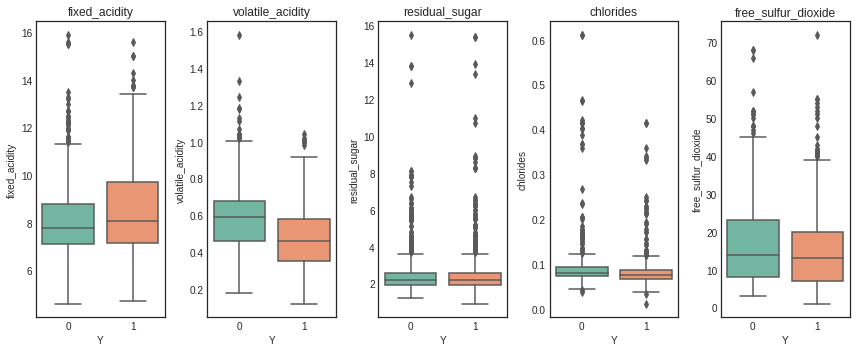
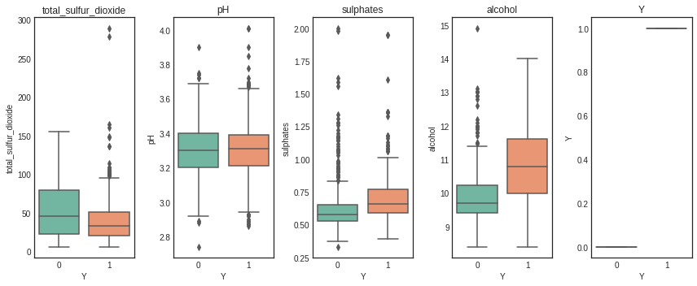
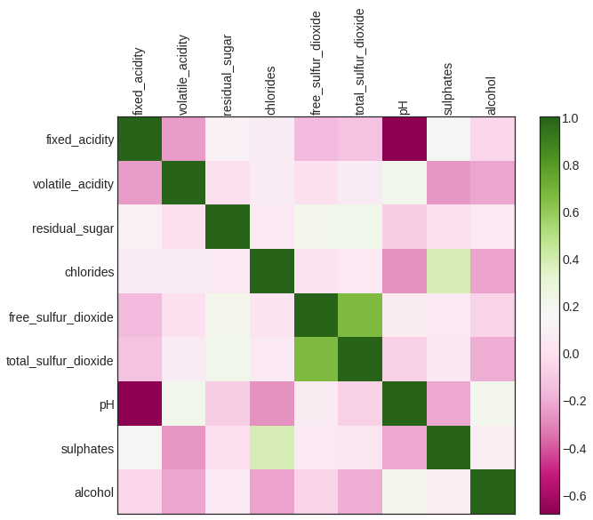
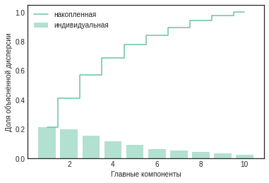
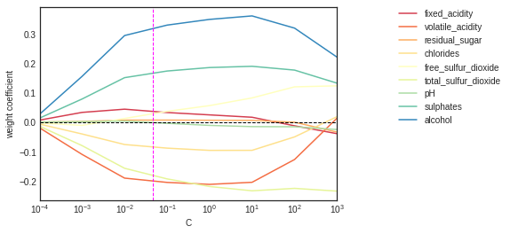

# Лабораторная работа №4: Методы снижения размерности. Регуляризация логистической регрессии.

_Модели_: множественная линейная регрессия

_Данные_: `winequality-red_for_lab`

_Метод снижения размерности_: **PCR**

_Метод регуляризации_: **ридж\-регрессия**

# Загрузка данных

Загружаем данные и оставляем необходимые переменные. Откладываем 15% наблюдений для прогноза.

# Предварительный анализ данных

Выводы по описательным статистикам: значения объясняющих переменных положительные, масштабы измерения отличаются. Для работы с методами снижения размерности и регуляризации понадобится стандартизация значений.   

Поскольку в наборе данных 9 объясняющих переменных, и все они непрерывные, анализ матричного графика разброса будет затруднительным. Построим коробчатые диаграммы для объясняющих переменных, чтобы сравнить средние уровни и разброс по классам.  

**Визуализация разброса переменных внутри классов**

На графиках отличие в медианах и разбросе между классами прослеживается практически по всем объясняющим переменным. Меньше всего различаются коробчатые диаграммы по переменной `fixed_acidity`, `chlorides`. Это говорит о том, классы по зависимой переменной `Y` могут неплохо разделяться по остальным объясняющим переменным.  

**Корреляционный анализ**

Между объясняющими переменными обнаруживаются как прямые, так и обратные линейные взаимосвязи.

# Снижение размерности

**Снижаем размерность методом PCR**

Проводим предварительную стандартизацию переменных и пересчитываем объясняющие показатели в главные переменные

Доли объяснённой дисперсии по компонентам в PLS:
[0.225 0.16  0.133 0.112 0.104 0.086 0.074 0.061 0.046].
Общая сумма долей: 1.0

**График объяснённой дисперсии**

Столбцы на графике показывают долю исходной дисперсии исходных переменных, которую объясняет главная компонента. Линией показана накопленная доля. Так, видно, что первые 5 компонент объясняют почти 80% исходной дисперсии $X$.   
Чтобы увидеть, как классы выглядят в координатах ГК на графике, придётся сократить пространство до двух компонент, которые объясняют 40% разброса объясняющих переменных.  

**Главные компоненты по PCA**

Судя по графику, классы совсем не разделяются в пространстве двух главных компонент. Построим логистическую регрессию и оценим её точность с помощью перекрёстной проверки.

Модель `logit_PC2`, перекрёстная проверка по 10 блокам
**Acc = 0.65792**

# Регуляризация модели логистической регрессии

**Ридж-регрессия**

Константы моделей для классов:
[0.913]. 
Коэффициенты моделей для классов:
[-0.178 -0.682  0.008  0.354 -0.007  0.193 -0.015  0.118  1.346]

Подбираем гиперпараметр регуляризации $\lambda$ с помощью перекрёстной проверки **21.5443469**

Модель `logit_ridge`, перекрёстная проверка по 10 блокам
**Acc = 0.75739**

**Изменение коэффициентов ридж-регрессии. Отсечка - оптимальный параметр C**

# Прогноз на отложенные наблюдения по лучшей модели

Модель `logit_PC2`. **Acc = 0.65792**

Модель `logit_ridge`. **Acc = 0.75739**

Так как точность у ридж-регрессии больше, чем у модели со сниженной размерностью, то стоит выбрать данную модель для прогноза на отложенных наблюдениях

| | precision | recall | f1-score | support |
| :---: |     :---:      | :---: | :---: | :---: |
| 0 | 0.66 | 0.51 | 0.58 | 241 |
| 1 | 0.79 | 0.87 | 0.82 | 494 |
| accuracy | | | 0.75 | 735 |
| macro avg| 0.72 | 0.69 | 0.70 | 735 |
| weighted avg | 0.74 | 0.75 | 0.74 | 735 |

Итак, методом логистической регрессии со сжатием коэффициенты с L2-регуляризацией мы получили достаточно точную модель классификации двух видов белых вин.  
