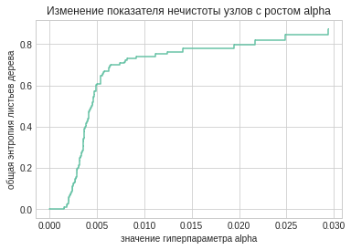
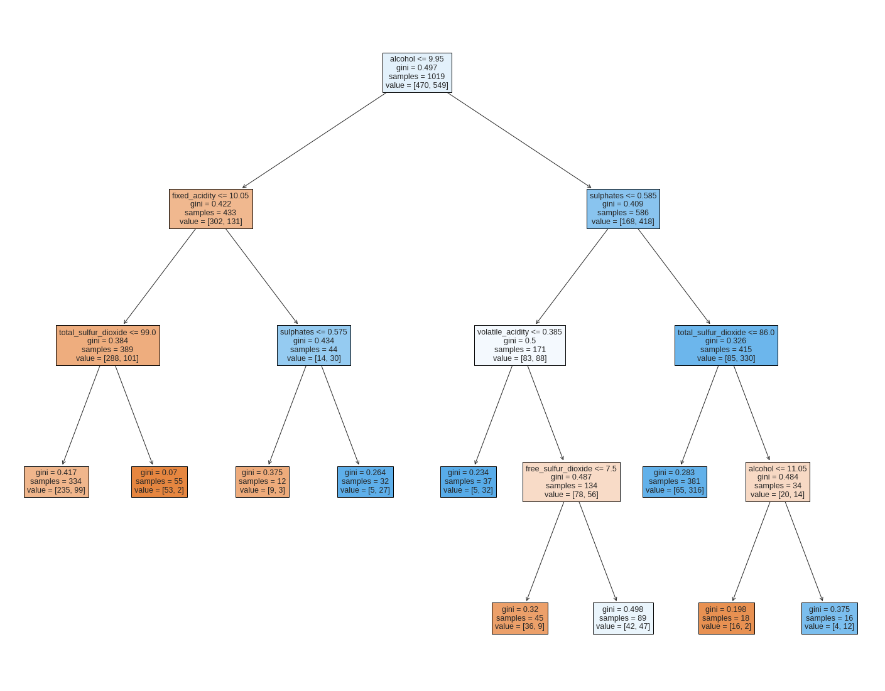
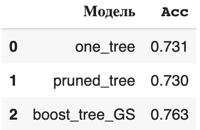
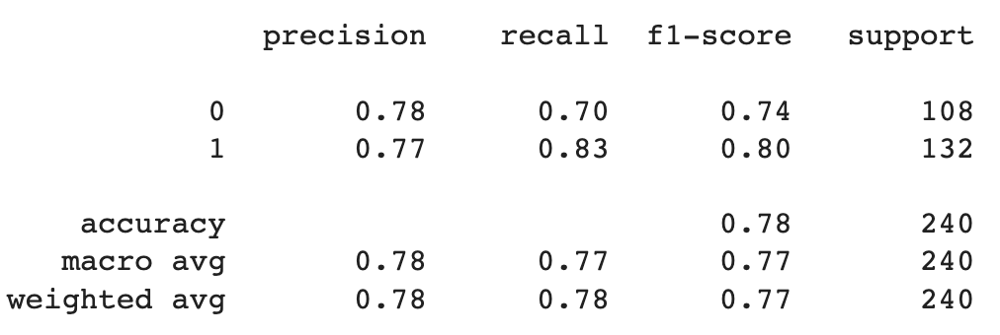

`Дисциплина: Методы и технологии машинного обучения`   
`Уровень подготовки: бакалавриат`   
`Направление подготовки: 01.03.02 Прикладная математика и информатика`   
`Семестр: осень 2022/2023`  

# Лабораторная работа №5: Методы, основанные на деревьях решений. Регрессионные деревья. Деревья классификации. Бустинг.  

В практических примерах ниже показано:   

* как делать перекодировку признаков в номинальной и порядковой шкалах
* как вырастить дерево и сделать обрезку его ветвей   
* как настроить модель бустинга 
* как подбирать настроечные параметры моделей методом сеточного поиска  

Точность модели оценивается методом перекрёстной проверки по 5 блокам.  

Данные были взяты из прошлой лабораторной работы по регуляризации регрессии:
https://raw.githubusercontent.com/ania607/ML/main/data/winequality-red_for_lab.csv

Перекодировка номинальной и порядковой шкалы была не нужна, все переменные корректны. Далее строим дерево с обрезкой ветвей.

Пример дерева с 17 узлами:

Делее мы воспользуемся алгоритмом бэггинга. Перебрам 5 различных значений B ([10, 20, 30, 40, 50]), лучшим оказалось 40

Сравним точность построенных моделей

Все модели показывают среднюю точность по показателю  𝐴𝑐𝑐 , при этом самой точной оказывается модель бэггинга. Сделаем прогноз на отложенные наблюдения.

Сравним точность на отложенных наблюдениях с точностью моделей из упражнения 4. 

Точность моделей из упражнения 4 оказалась лучше.

